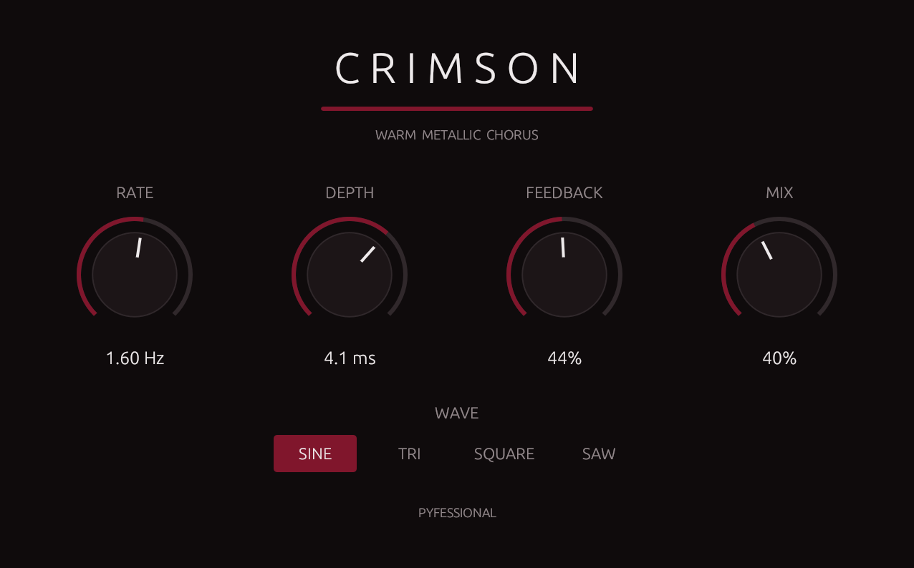

# Crimson

A warm metallic vocal chorus plugin, written from scratch in Rust.



Crimson is a stereo chorus voiced for modern vocals. A modulated delay line,
a breathing low-pass filter that tracks the LFO, a fixed high-pass to keep the
low end tight, and a light feedback path combine into a warm, metallic shimmer
that sits with pitch-corrected vocals rather than fighting them.

**[Download for macOS, Windows, or Linux →](https://github.com/MichaelAngulo3232/crimson-chorus/releases/latest)**

Free and open source. No account, no signup. More at [pyfessional.tech](https://pyfessional.tech).

**Formats:** VST3 · CLAP
**Platforms:** macOS · Windows · Linux

## What's interesting here

This is a real-time audio plugin with all of its DSP written by hand — no
wrapper around an existing engine.

- **Per-channel delay lines** with a fixed base delay plus LFO-modulated depth,
  keeping the effect in true chorus territory (never collapsing to a
  through-zero flanger). The LFO is offset 90° between channels, so the width
  survives a fold-down to mono.
- **Fractional-delay reads** with linear interpolation from a hand-rolled
  circular buffer.
- **Sample-rate-independent filters** — the low-pass and high-pass coefficients
  are derived from cutoff frequency and sample rate at runtime, so the plugin
  sounds identical at 44.1, 48, and 96 kHz.
- **A breathing low-pass** whose cutoff is swept geometrically by the LFO,
  deliberately brightening at longer delays (the opposite of a vintage
  bucket-brigade chorus) for a distinct timbral movement.
- **Band-limited LFO shapers** — sine, triangle, square, and sawtooth are each
  synthesized from a truncated Fourier series and
  peak-normalized, so switching shapes never changes the modulation depth or
  steps the delay line.
- **A stable feedback path** — the filter chain sits inside the loop, so every
  regeneration is darker (warm, not harsh) and low-frequency energy can't
  accumulate across repeats. Loop gain stays below unity by construction.
- **Real-time safe:** no allocation on the audio thread (enforced at runtime by
  nih-plug's `assert_process_allocs`), denormal flushing to keep the CPU from
  stalling during silence, and clean state reset on transport stop.
- **Zero reported latency** — the dry signal passes through untouched and
  time-aligned, so no delay compensation is needed.

## Controls

| Control  | Range           | Default |
|----------|-----------------|---------|
| Rate     | 0.01–3 Hz       | 1.60 Hz |
| Depth    | 0.5–6 ms        | 4.1 ms  |
| Feedback | 0–90%           | 44%     |
| Mix      | 0–100%          | 40%     |
| Waveform | Sine/Tri/Sq/Saw | Sine    |

The defaults are voiced, not arbitrary — they were set on real tuned vocals.
Start there. Feedback above roughly 70% is deliberately allowed to get resonant
and strange; that's character, not a bug, but it isn't where the plugin was
voiced.

## Install

Copy the format your DAW uses into the matching folder:

- **macOS:** `~/Library/Audio/Plug-Ins/VST3/` or `~/Library/Audio/Plug-Ins/CLAP/`
- **Windows:** `%COMMONPROGRAMFILES%\VST3\` or `%COMMONPROGRAMFILES%\CLAP\`
- **Linux:** `~/.vst3/` or `~/.clap/`

Then rescan plugins in your DAW.

### If macOS says the plugin is damaged

The file is fine — that's Gatekeeper. Crimson isn't code-signed with an Apple
Developer ID yet, so macOS quarantines it after download. Clear the flag:

```
xattr -rd com.apple.quarantine ~/Library/Audio/Plug-Ins/VST3/Crimson.vst3
xattr -rd com.apple.quarantine ~/Library/Audio/Plug-Ins/CLAP/Crimson.clap
```

Run only the line for the format you installed. On Windows, SmartScreen will
warn for the same reason — choose **More info → Run anyway**.

### Compatibility

Works in Ableton Live, FL Studio, Reaper, Bitwig, Studio One, Cubase, and other
VST3 or CLAP hosts.

Logic Pro and GarageBand are **not** supported — they require the AU format,
which nih-plug does not build.

## Building

Crimson is built with [nih-plug](https://github.com/robbert-vdh/nih-plug).

```
cargo xtask bundle chorus --release
```

Bundles are written to `target/bundled/` as `Crimson.clap` and `Crimson.vst3`.
The `bundler.toml` at the repo root maps the package name `chorus` to the
bundle name `Crimson`.

### Releasing

```
./release.sh <version>     # e.g. ./release.sh 1.2.0
```

Bumps `Cargo.toml`, runs clippy and a release build locally, commits, tags, and
pushes. GitHub Actions then builds all three platforms and publishes the release
with the zips attached. A failed check rolls the version bump back and tags
nothing.

## License

GPLv3. See [LICENSE](LICENSE).

Built on nih-plug, whose VST3 support requires GPLv3-compatible licensing.
